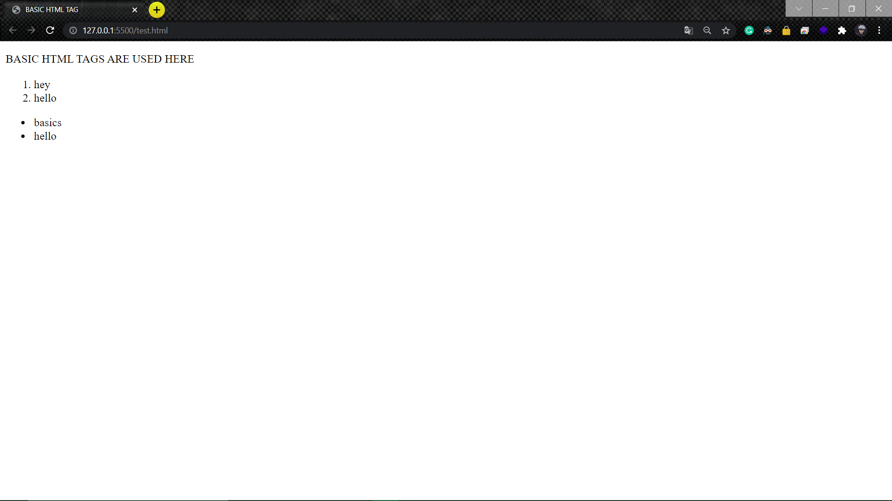

# Experiment_Basic_HTML_Tag

## AIM
To Write a html webpage using heading, paragraph and list tags.

# ALGORITHM
### STEP 1
create a simple html page using heading tag
### STEP 2
Add a paragragh tag to the program
### STEP 3
Add a list tag both ordered and unordered list tag
### STEP 4
Execute the program

# CODE
~~~
<!DOCTYPE html>
<html lang="en">
<head>
    <meta charset="UTF-8">
    <meta http-equiv="X-UA-Compatible" content="IE=edge">
    <meta name="viewport" content="width=device-width, initial-scale=1.0">
    <title>BASIC HTML TAGs</title>
</head>
<body>
    
BASIC HTML TAGS ARE USED HERE

    <ol>
        <li>hey</li>
        <li>hello</li>
    </ol>
    <ul>
        <li>basics</li>
        <li>hello</li>
    </ul>
</body>
</html>

~~~
# OUPUT

# RESULT

webpage using heading, paragraph and list tags are successfully executed.